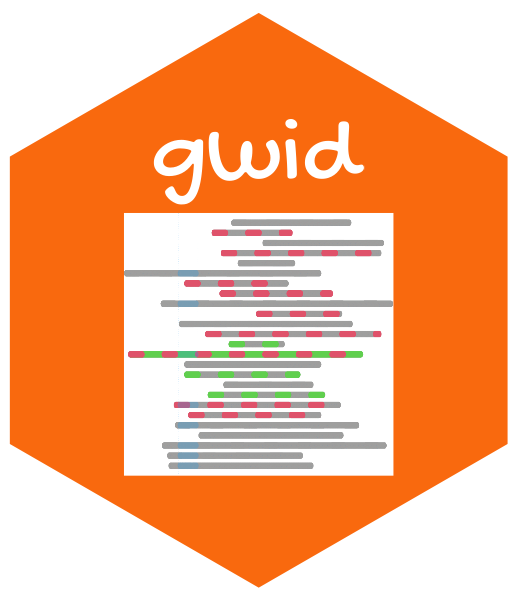

<!-- README.md is generated from README.Rmd. Please edit that file -->

```{r, include = FALSE}
knitr::opts_chunk$set(
  collapse = TRUE,
  comment = "#>",
  fig.path = "man/figures/README-",
  out.width = "100%"
)
```

# Multivariate Hybrid PCA 

<!-- badges: start -->
[](https://github.com/soroushmdg/gwid/actions/workflows/R-CMD-check.yaml)
<!-- badges: end -->

MHPCA

## Usage

The `MHPCA` package 

## Installation

You can install the stable version of `gwid` from [CRAN](https://cran.r-project.org/) with:

Alternatively, you can install the stable version of `MHPCA`
with:

```{r eval=FALSE}
# install.packages("remotes")
remotes::install_github("mmadoliat/MHPCA")
```

## Example

### Input

### `plot` method
